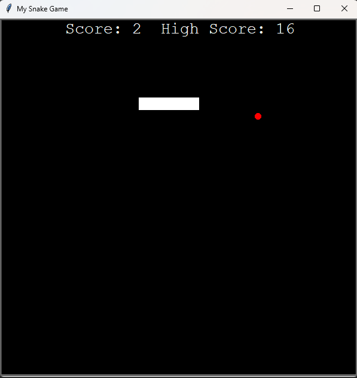

# Snake Game

This project implements the classic **Snake Game** using the Python `turtle` module. It features a responsive game loop, a growing snake, randomly positioned food, and a local high score tracker.

---

## Purpose

To create a playable and visually appealing Snake Game where players can aim to achieve the highest possible score.

---

## Features

1. **Snake Movement**:
   - The snake starts with three segments and moves continuously on the screen.
   - The player controls the direction (up, down, left, right) using keyboard inputs.

2. **Food Generation**:
   - Food appears randomly on the game board.
   - The snake grows in size upon consuming food.

3. **Collision Detection**:
   - Detects collisions with walls or the snake's own body, resetting the game.

4. **Score Tracking**:
   - Tracks the player's current score.
   - Saves and displays the highest score achieved across game sessions.

5. **Customizable Board**:
   - Game board size and colors are easily adjustable.

---

## Screenshots


---

## Tools Used

- **Turtle Module**: For graphics and UI rendering.
- **Random Module**: For generating random food positions.
- **Time Module**: For managing game loop timing.

---

## How to Play

1. **Game Start**:
   - Run the script to start the game.
   - Use the arrow keys to control the snake.

2. **Objective**:
   - Eat as many food items as possible to grow the snake and increase your score.

3. **Game Over**:
   - The game ends when the snake collides with the wall or itself.
   - If the current score is higher than the saved high score, it updates automatically.

---

## Requirements

- Python 3.x
- Turtle module (included in standard Python installation)

---

## Installation

1. Clone the repository:
   ```bash
   git clone https://github.com/yourusername/snake-game.git
   ```

2. Navigate to the project directory:
   ```bash
   cd snake-game
   ```

3. Run the game:
   ```bash
   python main.py
   ```

---

## File Structure

- `main.py`: Main game logic and setup.
- `food.py`: Food class for managing food behavior and positioning.
- `snake.py`: Snake class for controlling movement, growth, and collision logic.
- `scoreboard.py`: ScoreBoard class for displaying and updating scores.
- `data.txt`: Stores the high score persistently.

---

## Key Bindings

| Key   | Action      |
|-------|-------------|
| Up    | Move Up     |
| Down  | Move Down   |
| Left  | Move Left   |
| Right | Move Right  |

---

## Notes

- The high score is saved in `data.txt`. Make sure this file is writable.
- Modify constants such as board size and colors directly in the source code for customization.

---
